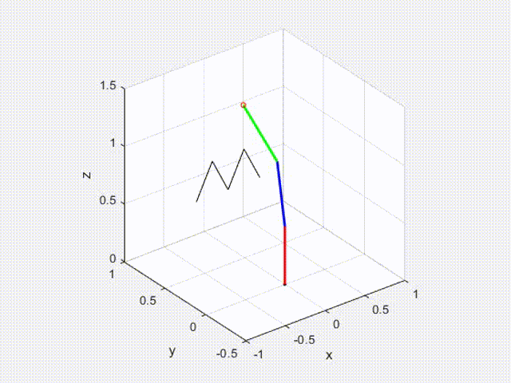

# M-Robot-3D-Manipulator-ModelandControl

An introductory tutorial suitable for **undergraduate or graduate students new to  robotics**, providing foundational yet crucial knowledge. 

Readers can gain insight into fundamental topics including:

- The paradigm of **multi-axis robot model construction**.
- **Lagrangian derivation of multi-rigid-body dynamics**.
- Methods for tuning parameters in **current, velocity, and position loops** for single motors.
- Basic **model-based control techniques**.
- **Trajectory planning methods**.
- **Forward and inverse kinematics solvers**.
- **Numerical simulation animation programming**.
